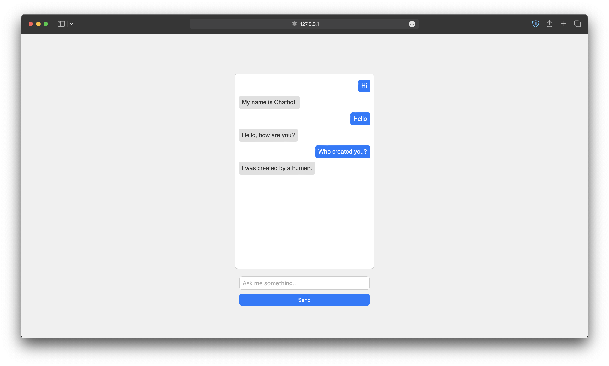

# Simple Python Chatbot

This is a simple python chatbot which uses json file to store the data. It uses TF-IDF (Term Frequency-Inverse Document Frequency) vectorizer and a Multinomial Naive Bayes classifier to classify the user input and give the response.

This project is under development and soon will be supported to web with multi modal support.

## Table of Contents

* [Screenshots](#screenshots)
* [Installation](#installation)
* [Usage](#usage)
* [Features](#features)
* [Authors](#authors)

## Screenshots



## Installation

Use the package manager [pip](https://pip.pypa.io/en/stable/) to install the required packages.

```bash
pip install -r requirements.txt
```

or

```bash
pip3 install -r requirements.txt
```

## Usage

```bash
python train.py
python app.py
```

or

```bash
python3 train.py
python3 app.py
```

## Features

- [x] Text support
- [x] Custom response support
- [ ] Image support
- [ ] Audio support
- [ ] Video support
- [ ] Muliple language support
- [ ] Markdown support
- [ ] Speech to text support
- [ ] Text to speech support
- [ ] Customizable

## Authors

* [Mantresh Khurana](https://github.com/mantreshkhurana)
